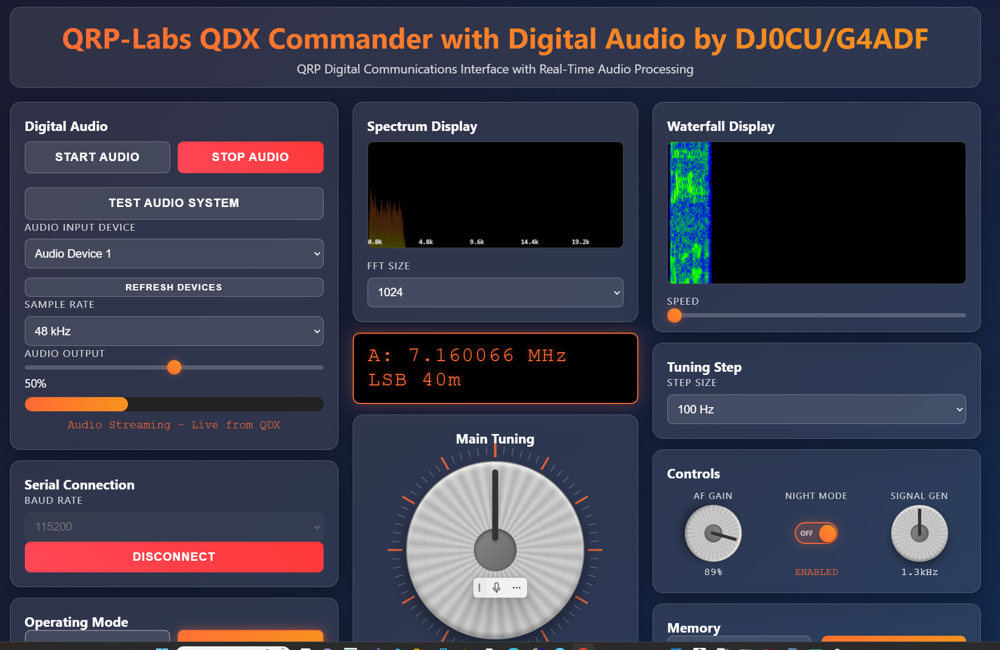

# QDX Commander

A modern web-based control interface for the QRP Labs QDX Digital Transceiver, providing comprehensive radio control through an intuitive browser interface.

## Screenshots




## Overview

QDX Commander is a sophisticated web application that transforms your QRP Labs QDX transceiver experience. Built with modern web technologies, it offers a sleek, responsive interface for controlling all aspects of your QDX digital modes transceiver.

### About the QDX

The QRP Labs QDX is a high-performance, four-band 5W digital modes transceiver featuring:
- **Bands**: 80m, 40m, 30m, 20m (with 60m, 17m, 15m, 12m, 10m support)
- **Power Output**: 5W from 9-10V supply
- **Built-in USB Sound Card**: 48ksps 24-bit stereo
- **CAT Control**: USB Virtual COM port serial interface
- **Signal Generator**: Built-in test signal capability
- **Clean Signal Output**: Zero residual carrier, zero unwanted sideband


## 🌐 Live Demo

**[► Launch Live Demo](https://sparks72.github.io/QDX-Commander/)**

*Try the interface directly in your browser - no installation required!*


## Features

### 🎛️ **Complete Radio Control**
- **Frequency Control**: Smooth tuning knob with real-time frequency display
- **Band Selection**: Quick switching between amateur radio bands
- **Mode Control**: USB/LSB operation modes
- **VFO Management**: Dual VFO (A/B) support with split operation

### 📡 **Advanced Interface**
- **LCD-Style Display**: Retro-inspired frequency readout
- **Real-time Meters**: S-meter and SWR monitoring
- **Status Indicators**: Connection status and transmit/receive state
- **Night Mode**: Reduced brightness for low-light operation

### 💾 **Memory Management**
- **10 Memory Channels**: Store and recall favorite frequencies
- **Quick Access**: One-click frequency recall
- **Import/Export**: Backup and restore memory configurations
- **Channel Labeling**: Custom names for easy identification

### 🔧 **Professional Controls**
- **AF Gain Control**: Precise audio level adjustment
- **Signal Generator**: Built-in test signal with frequency control
- **Tuning Steps**: Configurable step sizes (1Hz to 10kHz)
- **CAT Monitoring**: Real-time command logging and debugging

### 🌐 **Modern Web Interface**
- **Responsive Design**: Works on desktop, tablet, and mobile
- **Drag & Drop Panels**: Customizable layout
- **Keyboard Shortcuts**: Efficient operation
- **Real-time Updates**: Live status monitoring

## Quick Start

### Prerequisites
- QRP Labs QDX Transceiver (firmware 1.08 or later)
- Modern web browser with WebSerial API support:
  - Chrome 89+
  - Edge 89+
  - Opera 75+
- USB cable (Type A to Type B)

### Installation

1. **Clone the Repository**
   ```bash
   git clone https://github.com/yourusername/qdx-commander.git
   cd qdx-commander
   ```

2. **Open the Interface**
   ```bash
   # Simply open the HTML file in your browser
   open QDX\ Commander.html
   # or
   firefox QDX\ Commander.html
   ```

3. **Connect Your QDX**
   - Connect QDX to your computer via USB
   - Click "Connect Serial" in the interface
   - Select your QDX device from the browser prompt
   - Configure WSJT-X or other software to use QDX audio device

## Usage

### First Connection

1. **Power on your QDX** and connect via USB
2. **Open QDX Commander** in a supported browser
3. **Click "Connect Serial"** and select the QDX device
4. **Test connection** using the "Test CAT" feature
5. **Configure your digital modes software** (WSJT-X, JS8Call, etc.)

### Basic Operations

- **Change Frequency**: Use the large tuning knob or direct entry
- **Switch Bands**: Click band buttons (80m, 40m, 30m, 20m, etc.)
- **Store Memory**: Select memory mode, choose channel, store current settings
- **Adjust Audio**: Use the AF Gain knob for optimal audio levels
- **Monitor Status**: Watch S-meter, SWR, and connection indicators

### Memory Management

```
Quick Store: Double-click memory button while in recall mode
Edit Memory: Right-click memory button for detailed editing
Export All: Save all memories to JSON file for backup
Import: Restore memories from previously saved file
```

### Advanced Features

- **Panel Customization**: Drag panels between columns using panel headers
- **CAT Debugging**: Monitor all CAT commands in real-time
- **Signal Generator**: Test audio paths with built-in signal source
- **Night Mode**: Reduce LED brightness for comfortable operation

## Configuration

### WSJT-X Setup

1. **Audio Tab**:
   - Input: "QRP Labs QDX Transceiver"
   - Output: "QRP Labs QDX Transceiver"

2. **Radio Tab**:
   - Rig: "Kenwood TS-440"
   - Serial Port: Select QDX port
   - PTT Method: "CAT"
   - Poll Interval: 10 seconds

3. **Test CAT**: Verify green indicator

### Browser Compatibility

| Browser | Version | WebSerial Support |
|---------|---------|-------------------|
| Chrome | 89+ | ✅ Full Support |
| Edge | 89+ | ✅ Full Support |
| Firefox | Any | ❌ Not Supported |
| Safari | Any | ❌ Not Supported |
| Opera | 75+ | ✅ Full Support |

## Troubleshooting

### Connection Issues

**Problem**: Cannot connect to QDX
- Ensure QDX is powered and connected via USB
- Try a different USB cable
- Check that no other software is using the serial port
- Restart browser and try again

**Problem**: CAT commands not working
- Verify baud rate settings (115200 recommended)
- Check serial port selection in both QDX Commander and WSJT-X
- Ensure only one application accesses the serial port at a time

### Audio Issues

**Problem**: No audio in WSJT-X
- Verify QDX is selected as audio device in WSJT-X
- Check audio levels are set to maximum (100%)
- Test audio path using signal generator

**Problem**: Cannot transmit
- Check PTT method is set to "CAT" in WSJT-X
- Verify QDX Commander shows "CONNECTED" status
- Monitor status LED on QDX for diagnostic codes

## Development

### Project Structure

```
qdx-commander/
├── QDX Commander.html    # Main application file
├── README.md            # This file
├── docs/               # Documentation
│   └── QDX-Manual.pdf  # Official QDX manual
└── screenshots/        # Application screenshots
```

### Contributing

1. Fork the repository
2. Create a feature branch (`git checkout -b feature/amazing-feature`)
3. Commit your changes (`git commit -m 'Add amazing feature'`)
4. Push to the branch (`git push origin feature/amazing-feature`)
5. Open a Pull Request

### Code Style

- Use modern ES6+ JavaScript features
- Follow responsive design principles
- Maintain compatibility with WebSerial API
- Include comprehensive error handling
- Document all CAT command implementations

## Technical Details

### CAT Command Support

QDX Commander implements the Kenwood TS-480/TS-440 CAT command subset:

- **FA/FB**: VFO A/B frequency control
- **MD**: Operating mode (USB/LSB)
- **AG**: AF gain control
- **TX/RX**: Transmit/receive switching
- **IF**: Transceiver status information
- **Q0-QB**: Extended QDX configuration commands

### WebSerial Implementation

The interface uses the modern WebSerial API for direct browser-to-hardware communication:

```javascript
// Connection example
const port = await navigator.serial.requestPort();
await port.open({ baudRate: 115200 });
```

### Memory Format

Memory channels are stored in JSON format:

```json
{
  "frequency": 14074000,
  "mode": "USB",
  "band": "20",
  "label": "FT8 Calling",
  "timestamp": "2025-01-27T..."
}
```

## License

This project is licensed under the MIT License - see the [LICENSE](LICENSE) file for details.

## Acknowledgments

- **QRP Labs** for the excellent QDX transceiver design
- **Hans Summers G0UPL** for the comprehensive documentation and CAT protocol
- **Amateur Radio Community** for continuous feedback and suggestions

## Support

- 📖 **Documentation**: [QRP Labs QDX Page](http://qrp-labs.com/qdx)
- 💬 **Community**: [QRP Labs Group](http://qrp-labs.com/group)
- 🐛 **Issues**: [GitHub Issues](https://github.com/sparks72/qdx-commander/issues)
- 📧 **Contact**: [Your Email](mailto:dj0cu@darc.de)

---

**73!** Happy DXing with your QDX! 📻
